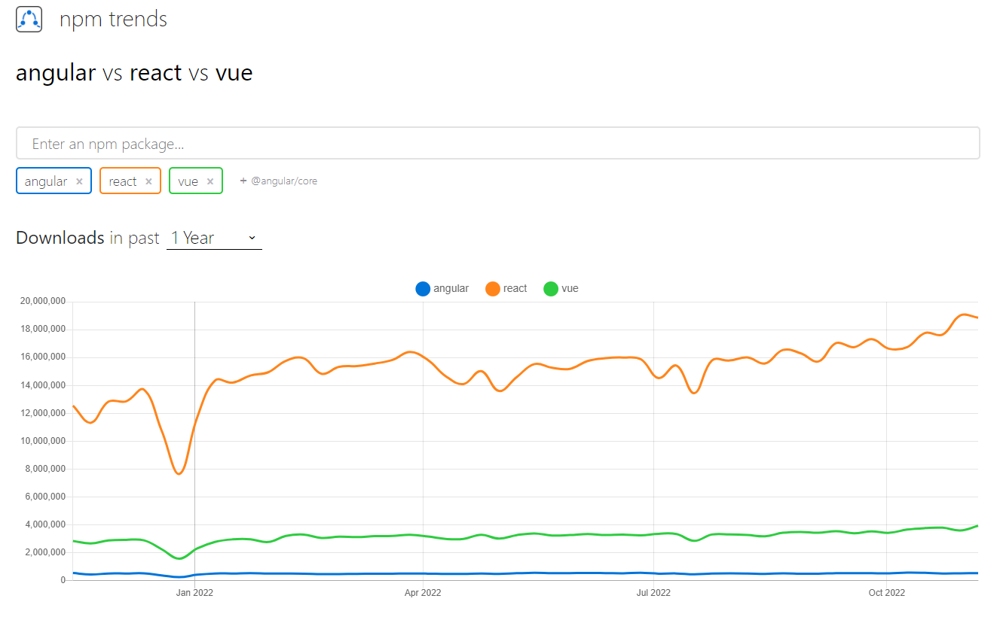
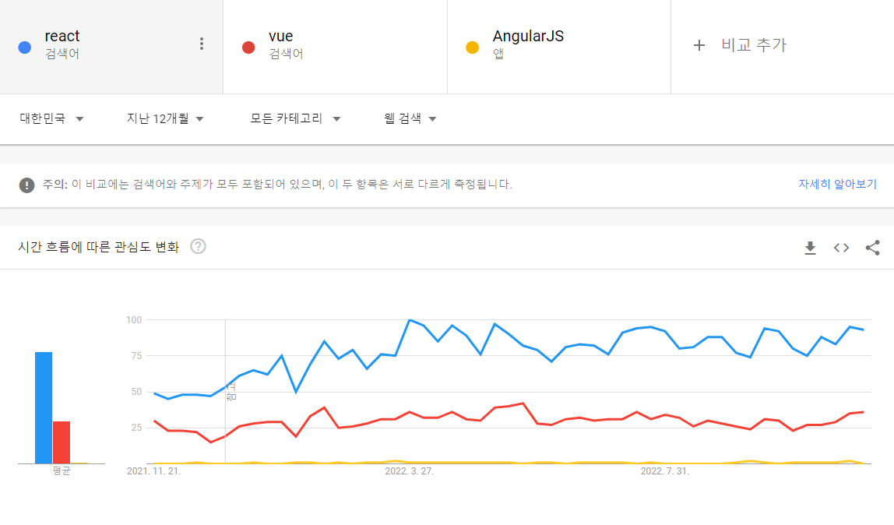
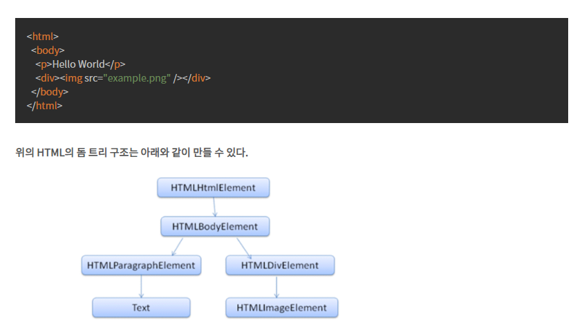
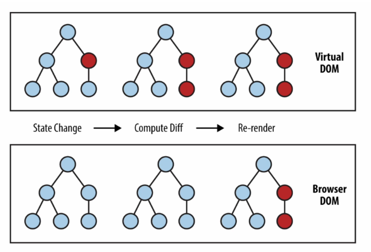
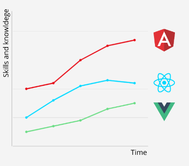
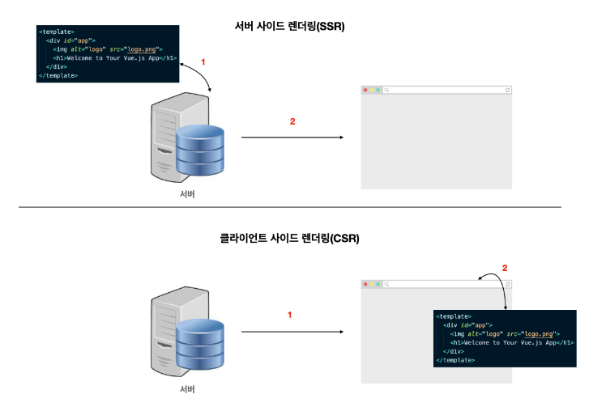
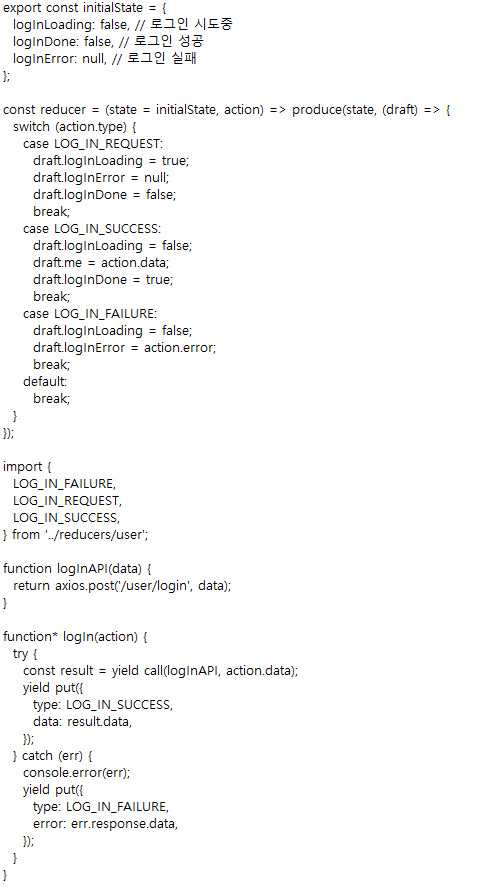
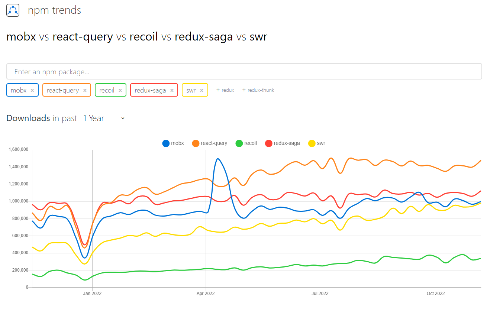
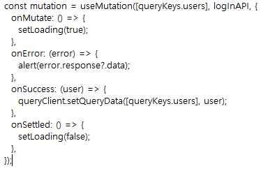

1 react 란?
meta에서 제공해주는 대중적인 spa 라이브러리/프레임워크 (앵귤러,vue) 등이 있음

spa란? 싱글페이지애플리케이션 한번 웹 페이지가 로딩되면 사용자가 새로고침 하지 않는 이상 페이지를 새로 로딩하지 않는 애플리케이션
=> 하나의 페이지에 다양한 내용이 동적으로 동작하는 애플리케이션

왜 쓰냐? => 필요성
react를 사용하지 않아도, html, css, javascript를 이용해서 웹 페이지를 만들 수 있지만,
react를 이용해 사용자와 상호작용할 수 있는 동적인 UI를 [쉽게] 만들 수 있기 때문에 많이 이용

기존 웹과 차이점

1. 새로고침이 없이 변경되는 화면
2. 가상돔
3. Component를 사용한 재사용이 가능하고 유지보수의 용이함

특징 및 장점

1. Component 기반 구조
   React는 UI(View)를 여러 컴포넌트(component)를 쪼개서 만듭니다.
   한 페이지 내에서도 여러 각 부분을 [독립된 컴포넌트]로 만들고, 이 컴포넌트를 조립해 화면을 구성합니다.
   컴포넌트 단위로 쪼개져 있기 때문에, 전체 코드를 파악하기가 상대적으로 쉽습니다.
   이렇게 기능 단위, UI 단위로 캡슐화시켜 코드를 관리하기 때문에 [재사용성]이 높습니다.
   따라서 코드는 반복해 입력할 필요 없이, 컴포넌트만 import해 사용하면 된다는 간편함이 있으며,
   애플리케이션이 복잡해지더라도 코드의 유지보수, 관리가 용이해지는 장점을 가집니다.

2. 가상 돔 (Virtual DOM)
   리액트는 가상 돔을 사용하여 웹 애플리케이션의 성능을 극대화
   페이지를 이동하면 웹페이지 전체가 바뀌는게 아니라 로딩된 페이지중 변경이 필요한 부분만 바꿔치기 가능함 그래서 이미 로딩된
   자원을 다시 서버로부터 받아 올 필요가 없기 때문에 웹 자원을 효율적으로 관리
   돔 ? Document Object Model로서 말 그대로 Document(웹페이지)를 객체로 표현하는 모델
   

3. 거대한 생태계 및 커뮤니티
   현재 jQuery, 혹은 일반 자바스크립트로 만들어진 라이브러리들도 리액트로 포팅되서 많이 작성되고있습니다.
   뿐만 아니라, 그냥 단순히 특정 기능을 구현하기 위한 라이브러리가 아니라
   프로젝트의 구조와 강하게 묶여있는 라우터, 상태 관리 라이브러리들도 매우 다양

기존 돔의 문제점

1. DOM에는 수 천개의 노드들이 존재할 수 있고, 업데이트를 위해 복잡한 처리과정이 필요하다.
2. DOM을 조작할 때 렌더링 트리는 각 변경 사항마다 하나씩 해석하여 렌더링을 시키게 되는 구조
3. 먼저 브라우저에서 페이지를 로드하게 되면 돔 트리와 렌더링 트리를 생성하고 [여러 과정(리플로우..리페인트..)]을 거쳐 브라우저에 CSS가 적용된 페이지가 그려지게 된다.
4. 즉 DOM을 조작할 때 렌더링 트리는 각 변경 사항마다 하나씩 해석하여 렌더링을 시키게 되는 구조이다.
   => 화면 업데이트 사항이 10개다 => 10번 리렌더링 => 돔을 업데이트 하는데 너무 많은 메모리가 든다.     

그럼 가상 돔(Virtual DOM)은 무엇이고 왜 사용할까?

1. 화면에 변화가 있을 때마다 실시간으로 돔 트리를 수정하지 않고 변경사항이 모두 반영된 가상 돔을 만들어 낸다
2. 다시 그릴 때마다 실제 DOM과 비교하고 전후 상태를 비교해, 변경이 필요한 최소한의 변경사항만 실제 DOM에 반영

1. State Change 상태가 변경되면
2. 변경된 돔을 검색하고 Compute Diff
3. 다시 렌더링 한다 Re-render
4. 가상돔을 만드는 과정에서 메모리를 안쓰는건 아니지만 결과로 본다면 기존보다 더 효율적인 사용

하지만 단점도...

1. 높은 러닝커브 , 새로운 버전에 대한 학습
   
2. seo (search engine optimization) - 검색엔진 최적화 이슈
   HTML 파일이 딱 1개뿐이고, 그 내용조차 서버에서 javascript를 받아서 렌더링하기 전까지는 빈 껍데기인 상태이기 때문에
   검색 엔진에 노출되기가 어렵습니다
   CSR (클라이언트 사이드 렌더링)
   서버 사이드의 렌더링은 앞에서 살펴본 클라이언트 사이드 렌더링과 무슨 차이점이 있을까요?
   바로 화면에 보일 페이지의 내용을 어디서 출력하느냐의 차이입니다
   클라이언트 사이드 렌더링은 페이지의 내용을 브라우저에서 출력하고
   서버 사이드 렌더링은 서버에서 페이지의 내용을 다 그려서 브라우저로 던져줍니다.
   
3. 높은 상태관리 복잡도 (state)
   상태란? 어플리케이션의 화면에 영향을 끼치는 자바스크립트 객체 => 변화하는 데이터
   상태가 많아지고 어플리케이션이 복잡해질수록 변화하는 데이터를 추적하기는 점점 힘들어질 것이다
4. 복잡성을 가진 프로젝트에 강점을 가진 react이기 때문에 큰 규모의 프로젝트가 아닌 간단한 정적 웹사이트를 만드는 것이라면 react를 사용하는 것은 비효율적

단점을 극복하는 방법

1. seo 이슈 => SSR (Server Side Rendering)
   서버 사이드 렌더링이란 서버에서 페이지를 그려 클라이언트(브라우저)로 보낸 후 화면에 표시하는 기법을 의미합니다
   서버에 데이터를 매핑해놓고 browser에 보여줍니다 서버의 요청에 맞춰서 렌더링을 하는 과정을 말합니다.
2. 높은 상태관리 복잡도 => 상태관리 라이브러리 (React-Query,Redux-Saga,Recoil,Mobx,SWR)

기존 상태관리 라이브러리 Redux-Saga의 불편했던점

- 너무 장황한 동일한 형식의 코드
  
- API 요청 수행을 위한 규격화된 방식 부재
  Redux를 사용하여 비동기 데이터를 관리하기 위해서는 관련된 상태 코드를 하나부터 열까지 개발자가 결정하고 구현
  (LOG_IN_FAILURE, LOG_IN_REQUEST, LOG_IN_SUCCESS, logInLoading, logInDone, logInError  ...)
   => 번거로움
좀 더 편리하고 효율적인 라이브러리가 없을까? => react-query 도입

react-query란?
React Query는 데이터 Fetching, 캐싱, 동기화, 서버 쪽 데이터 업데이트 등을 쉽게 만들어 주는 라이브러리

왜 쓰는지? 어떤 장점이있는지? 써서 얻는 이득들

1. 기존에 Redux, Mobx, Recoil과 같은 다양하고 훌륭한 상태 관리 라이브러리들이 있긴 하지만,
   클라이언트 쪽의 데이터들을 관리하기에 적합할 순 있어도 서버 쪽의 데이터들을 관리하기에는 적합하지 않은 점들이 있어서 등장하게 되었습니다.
   ex) 관리자 화면에서 동시에 두 명의 관리자가 같은 페이지를 바라보고 있는 상황에서 한 관리자가 유저의 데이터를 변경하면,
   화면을 새로고침 하지 않아도 다른 관리자 역시 그 유저의 변경된 데이터를 바라볼 수 있어야 합니다.
   이러한 유저의 데이터는 클라이언트 쪽보다는 서버 쪽에 좀 더 적합하다고 볼 수 있습니다.
2. 데이터 캐싱
    - API 콜 => 데이터 캐싱
    - API 재요청시 캐싱된 데이터라면 API 콜 x
    - 데이터의 최신화가 필요하다고 판단되면 API 콜
      => 캐싱 된 데이터로 인해서 API 콜을 줄여주며 서버에 대한 부담을 줄여줄 수 있음

react-query 로 바꾸고 편해진 점

- Boilerplate 코드의 감소
  
- API 요청 수행을 위한 규격화된 방식 제공
  (onSettled, onSuccess, onError ...)

하지만 단점도..

1. 그동안 리액트 시장을 redux-saga가 지배하고 있었다 보니 아직은 그들에 비해 커뮤니티 규모가 그리 크지 않습니다
   그래서 사용법에 대한 best practice 등이 잘 정립되지도 않음

이번 프로젝트에 React-Query를 적용해본 총평
불필요한 코드 감소로 인해 코드 생산성이 크게 증가해 빠르게 일처리할 수 있었고,
API 요청 수행 상태에 따른 규격화된 방식을 통해 코드를 좀 더 직관적으로 이해할 수 있어 유지보수성이 증가
